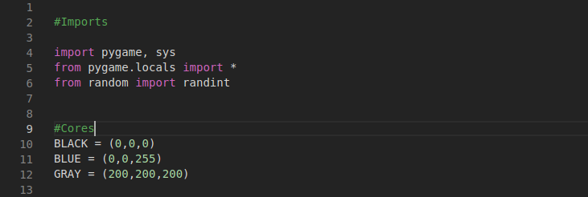
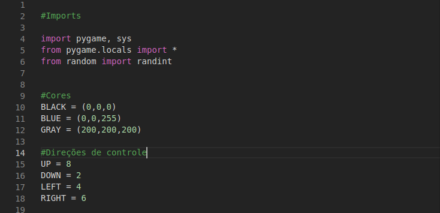
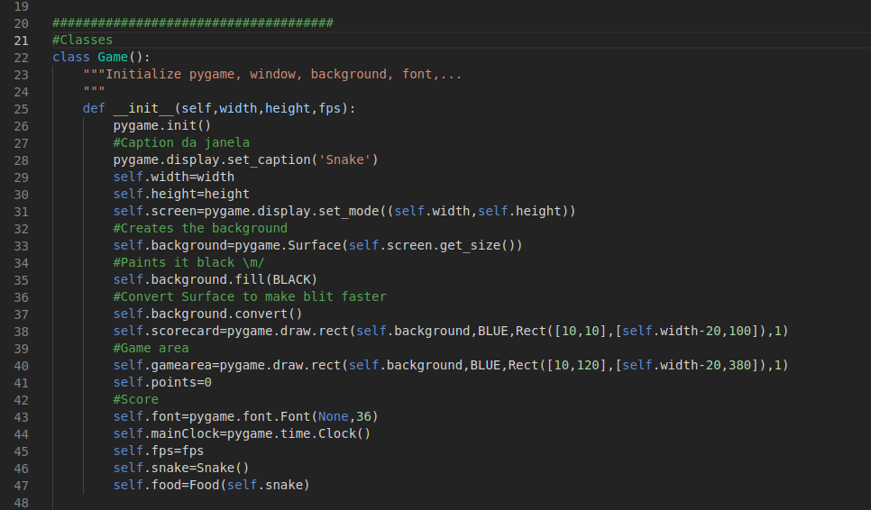
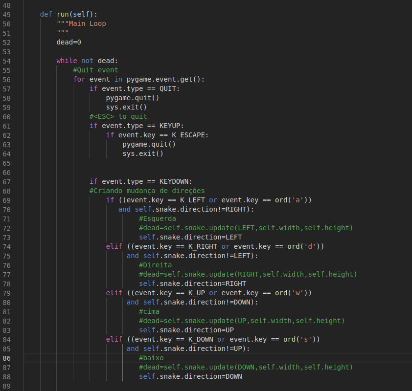
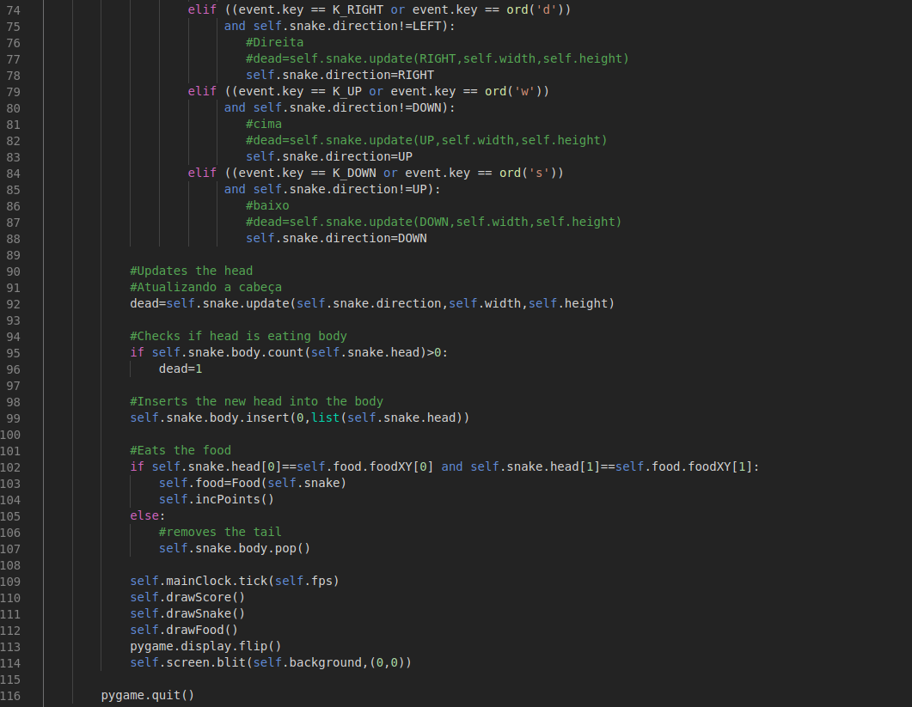
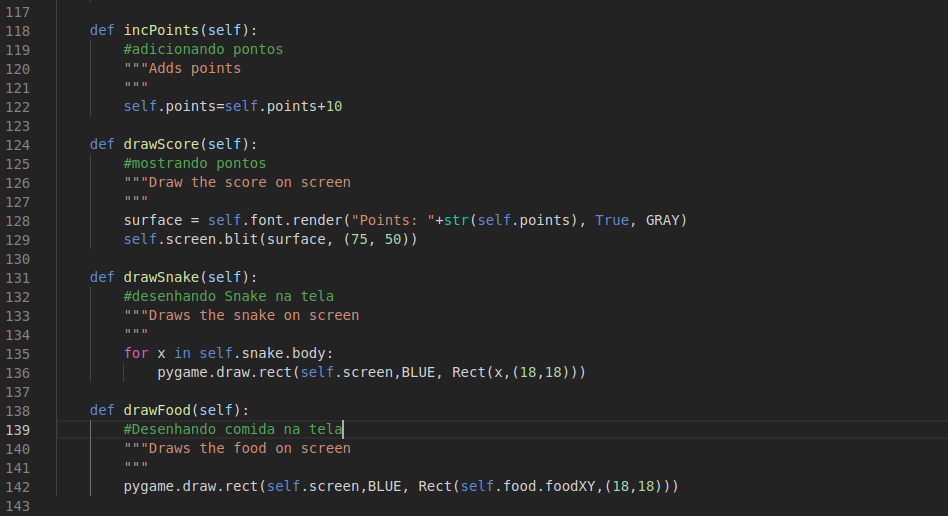
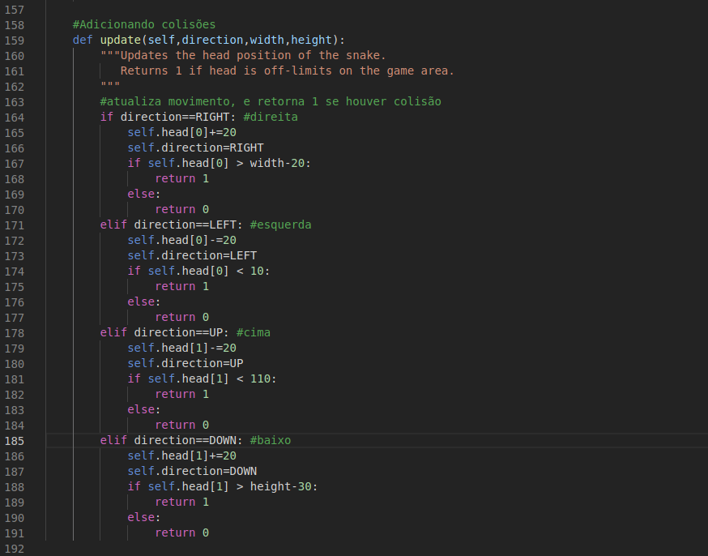
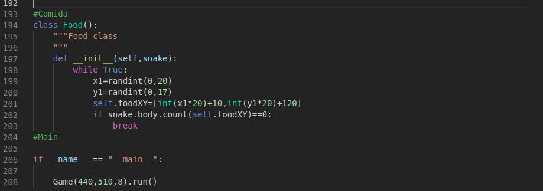

# Tutorial Jogo Snake 

# 1 - fazendo imports    

&emsp;&emsp;O primeiro passo para criar o jogo e fazermos os imports das bibliotecas necessárias, que nesse caso é a PyGame e a Random. Portanto, em código temos:

## 1.2 escolhendo cores

&emsp;&emsp;Nessa parte, definir as cores do jogo, que serão: Preto (<i>Black</i>), Azul (<i>Blue</i>) e Cinza (<i>Gray</i>), em código fica:

## 1.3 escolhendo as direções

&emsp;&emsp;Nessa parte, definir as direções de controle do jogo, que serão: Cima (<i>Up</i>), Baixo (<i>Down</i>), Esquerda (<i>Left</i>) e Direita (<i>Right</i>) em código fica:

# 2 - Criando Classes do jogo

## 2.1 - Classe para inicializar o jogo

&emsp;&emsp;Nessa parte, vamos iniciar o nosso jogo. Para isso, vamos criar a <i>class game</i> em código temos:

## 2.2 - função run

Agora, vamos criar a função para o jogo funcionar, e dentro dela usar a estrutura de repetição para capturar os eventos e direções do jogo, em código temos:

Agora, vamos atualizar os movimentos da Snake

## 2.3 - Criando desenho

Nessa parte, vamos criar na tela o desenho da Snake e do quadro de pontos, com as seguintes funções:

# 3 - Criando Snake

Vamos criar a classe Snake para criar nossa <i>Snake</i>, e dentro dessa classe, vamos iniciar a mesma, com a função de inicio.

## 3.1 - Verificando colisões

Dentro da classe <i>Snake</i>, vamos atualizar os movimentos e verificar se existe colisões.

# 4 - Comida

Agora, vamos criar a comida da Snake, utilizando a biblioteca RANDOM, para a comida aparecer em lugares aleatórios: 

